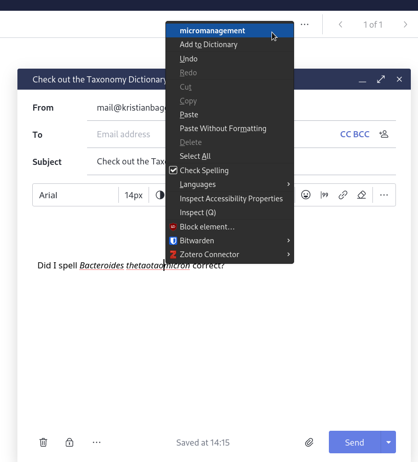
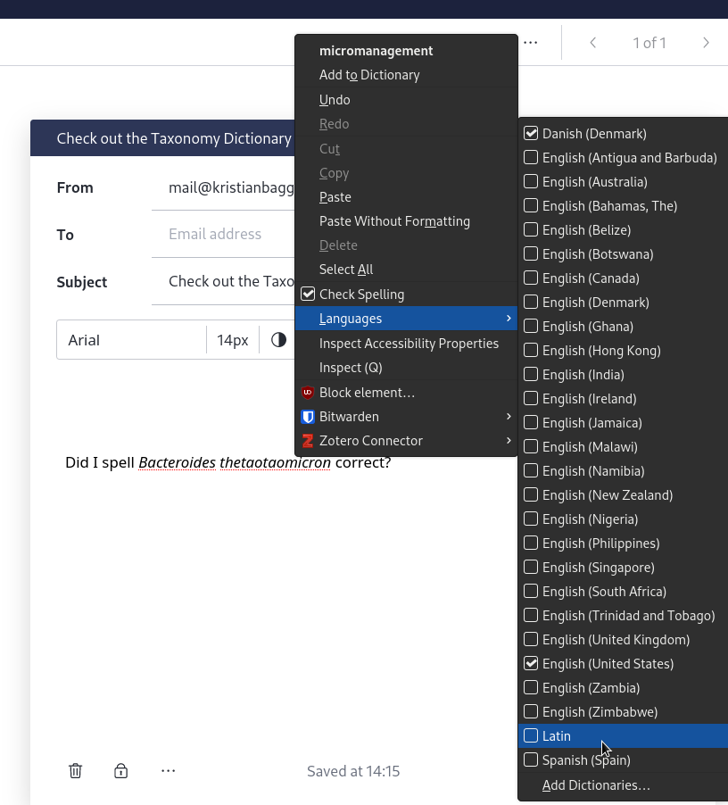
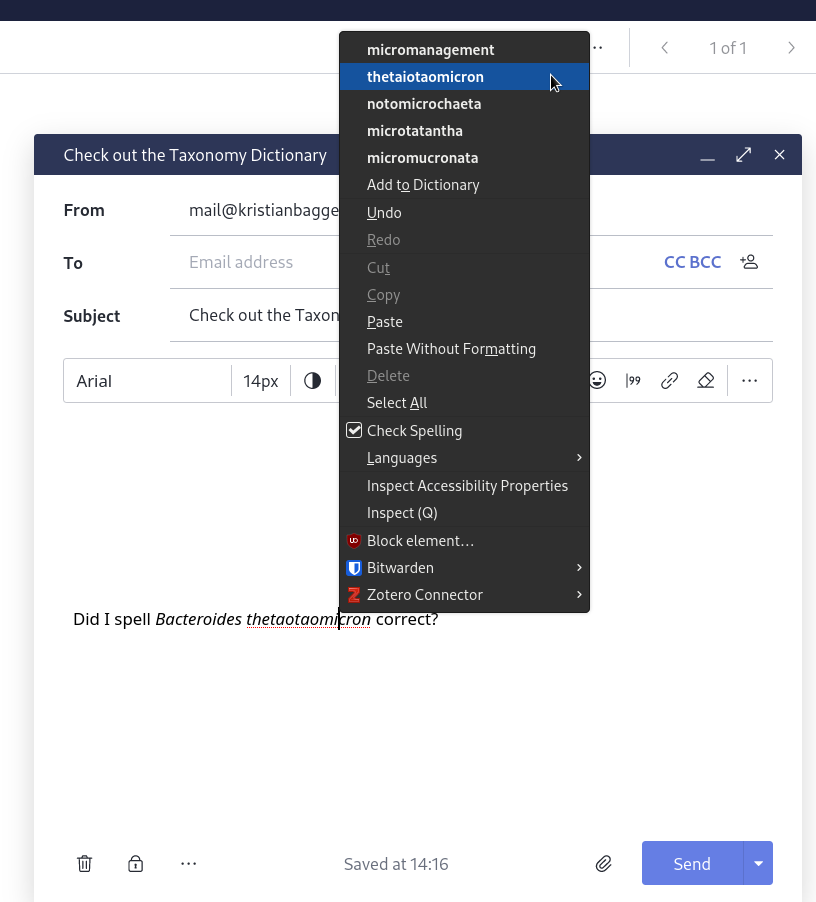

# The Taxonomy dictionary
## Firefox extension

This repository contains the [Firefox extension](https://addons.mozilla.org/en-US/firefox/addon/the-taxonomy-dictionary/) for [The Taxonomy Dictionary](https://github.com/kbagge/taxonomy_dictionary).
For further specification on sources and compilation of the dictionary, please see the [Taxonomy Dictionary repository](https://github.com/kbagge/taxonomy_dictionary).

### installation:
Install the Mozilla Firefox addon [here](https://addons.mozilla.org/en-US/firefox/addon/the-taxonomy-dictionary/).

### Use:
After installation you need to enable the dictionary.

As you can see, without enabling the dictionary the spelling engine have no good guess at what I was trying to write.

The Taxonomy Dictionary is labeled as Latin, so to enable it right click, then hover over "Languages" and click on "Latin".

Now Firefox will spell check all taxa at the same time as it spellchecks the rest of your writing.

